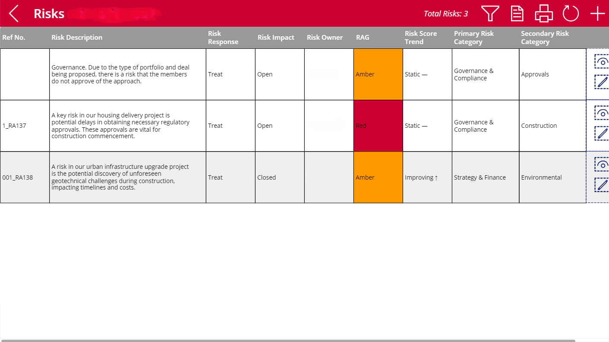
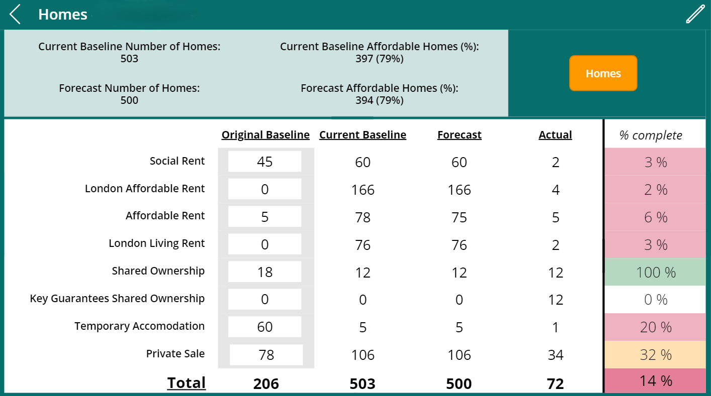

# Power Platform Applications
### This page demonstrates a few examples of applications I have developed in my career, outlining the requirements, solutioning and what the final end product looked like.

## Housing Delivery Programme Application
### Context & Requirements
The client required a unified solution to manage housing delivery project information that could be accessed by users across the business at no additional ongoing costs. This would be accessed by both technical and non-technical users and should be simply designed.

### Solution
I developed the front-end using Power Apps canvas apps to create a personalised application for the client that was intuitive to use. This included risks, issues, number of homes, milestones & status updates. Due to the application only being used by internal users I was able to manage authentication by creating a new Microsoft Environment and connecting this to SharePoint to import the security groups from there. This ensures that the security roles are consistent across the entire solution and changes to role permissions can be done on a single platform. As there were cost limitations to the project, SharePoint was used as the data source for the application as this is included within the standard Microsoft license.
The data model was simple - each of the modules within the application had it's own SharePoint list. The relationship between each of the lists was managed using a ProjectID - an auto-generated ID created using Microsoft Automate that was triggered any time a new project was created within the application. It was extremely unlikely that the number of records in any of the lists would exceed 5000 which meant SharePoint could easily handle the volume of data being stored.
The development was managed by integrating the application with Azure DevOps. This enabled multiple developers to work on the application at any one time (a significant limitation to using Power Apps) and helped accelerate the delivery of the solution.

***Any references to the client name and any information that could be used to identify the client has been removed from the application screenshots to ensure client confidentiality.***

### Landing Page
The landing page was a simple design displaying an image of a construction site and a small blurb describing the applications purpose. A small box with the users full name was created to help create a personal experience within the application and a validation for the user to confirm that they have been logged in correctly.

