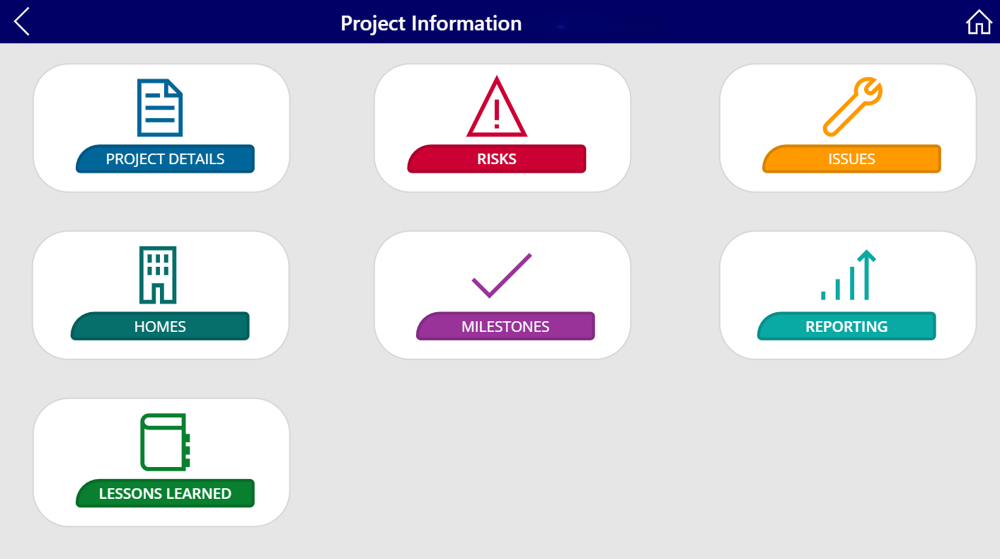
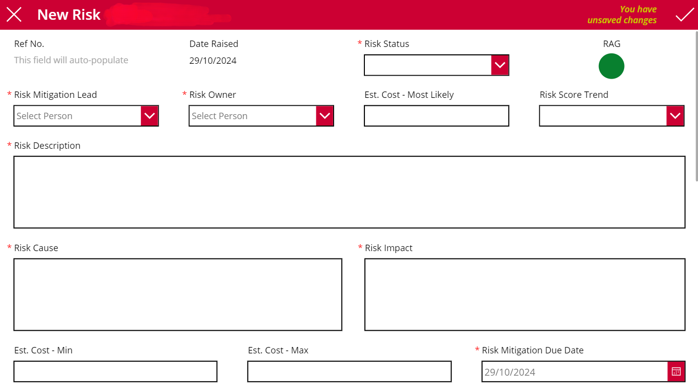

## Housing Delivery Programme Application
### Context & Requirements
The client required a unified solution to manage housing delivery project information that could be accessed by users across the business at no additional ongoing costs. This would be accessed by both technical and non-technical users and should be simply designed.

### Solution Overview
I developed the front-end using Power Apps canvas apps to create a personalised application for the client that was intuitive to use. This included risks, issues, number of homes, milestones & status updates. Due to the application only being used by internal users I was able to manage authentication by creating a new Microsoft Environment and connecting this to SharePoint to import the security groups from there. This ensures that the security roles are consistent across the entire solution and changes to role permissions can be done on a single platform.

As there were cost limitations to the project, SharePoint was used as the data source for the application as this is included within the standard Microsoft license. The data model was simple - each of the modules within the application had it's own SharePoint list. The relationship between each of the lists was managed using a ProjectID - an auto-generated ID created using Microsoft Automate that was triggered any time a new project was created within the application. It was extremely unlikely that the number of records in any of the lists would exceed 5000 which meant SharePoint could easily handle the volume of data being stored. The development was managed by integrating the application with Azure DevOps. This enabled multiple developers to work on the application at any one time (a significant limitation to using Power Apps) and helped accelerate the delivery of the solution.

***Any references to the client name and any information that could be used to identify the client has been removed from the application screenshots to ensure client confidentiality. Any data that is visible is dummy data and is not accurate.***

### Landing Page
The landing page was a simple design displaying an image of a construction site and a small blurb describing the applications purpose. A small box with the users full name was created to help create a personal experience within the application and a validation for the user to confirm that they have been logged in correctly.

### Project Selection Screen
Once the user enters the application they can select from all projects that have previously been created within a programme. Each project has an image square, a bar at the bottom detailing the project name & address (redacted), and an information icon in the top left corner. This icon uses a context variable to show a pop-up when selected to provide some high-level information about the project. When a project is selected the user is taken to the module selection screen.

### Module Selection Screen
This screen contains all possible modules that the user can input information.

### Risks Screen
This screen contains a scrollable horizontal container with key fields relating to risks for each project. The top bar shows a dropdown filter, download links to supporting documentation, print option to show all visible risks on an A4 printable sheet, a refresh option, and a link to create a new risk. Closed risks are shaded in grey and the RAG status is colour coded to make the screen more engaging.

### Add a New Risk
This shows an example form input for adding a new risk. Some fields are auto-populated, some are generated using live formulas, and some are determined using a scoring matrix.

### Issues Screen
In the same format as the risks screen, issues for a project can be viewed in a scrollable horizontal container showing key fields for each and colour coding for open/closed issues.

### Homes Screen
The homes screen is formatted as a table view to enable users to easily edit across tenancy types and baselines.

- Original baseline is only editable once i.e. once this has been set it cannot be changed.
- Current baseline can be edited by a select number of users under the 'admin' security role.
- Forecast can be changed by all users and will trigger a change request if the change is outside the allowed thresholds of the current baseline. If the change request is approved by an admin then the value entered here will be used as the new current baseline.
- Actual can be changed by all users and should be used to represent the number of houses that have completed development.

