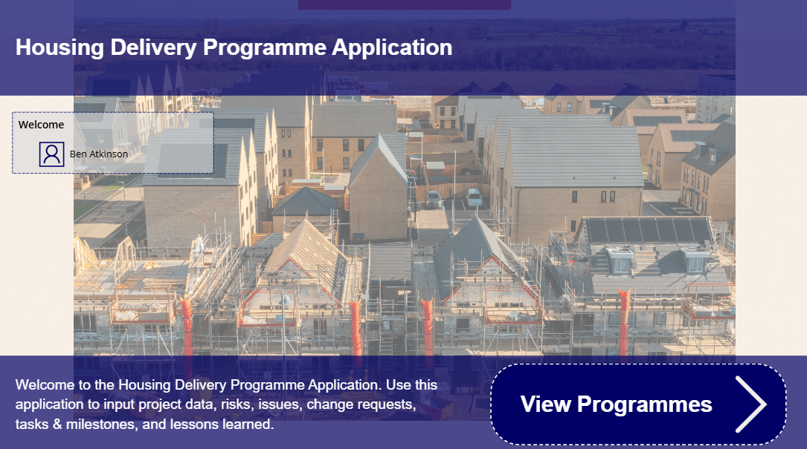
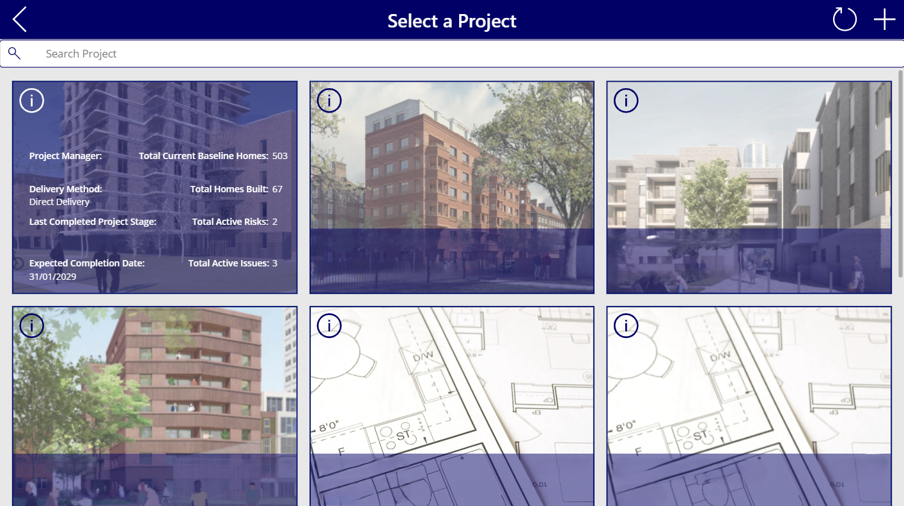
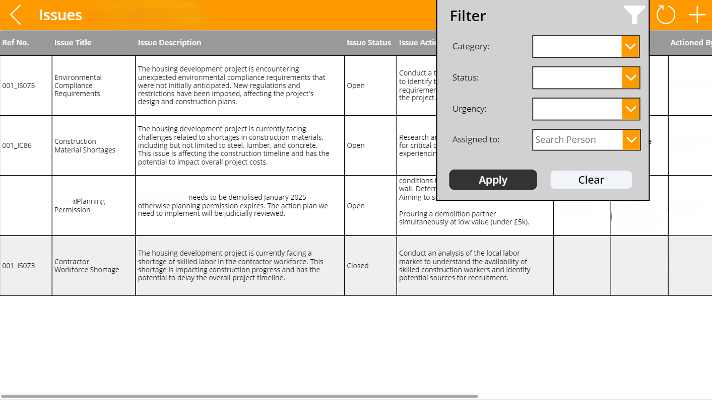
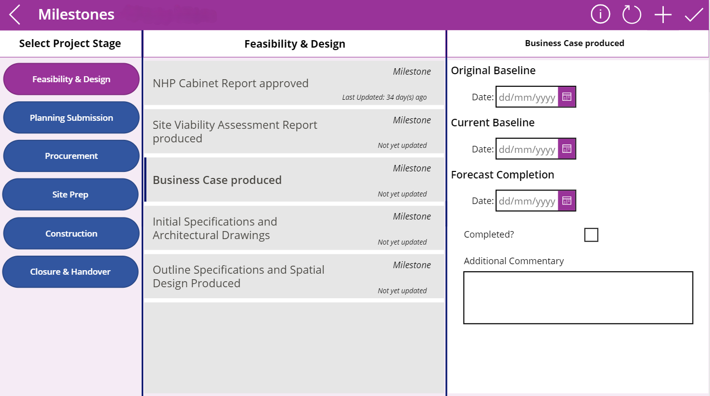
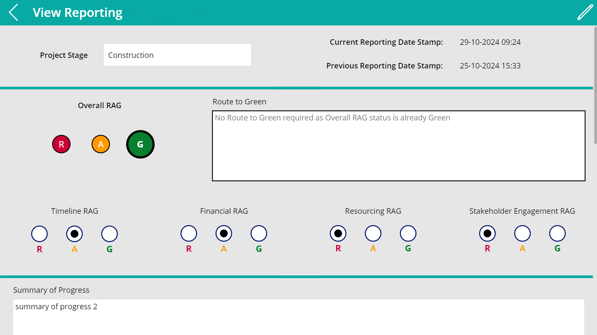

# Ben Atkinson - Power Platform Applications
This page demonstrates a few examples of applications I have developed in my career, outlining the requirements, solutioning and what the final end product looked like.

